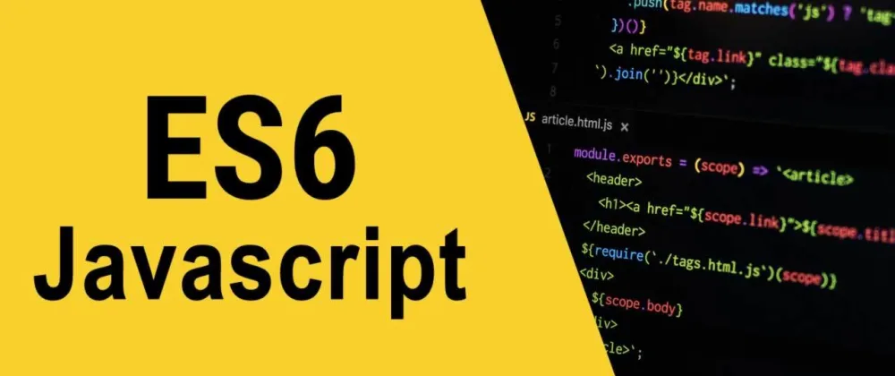
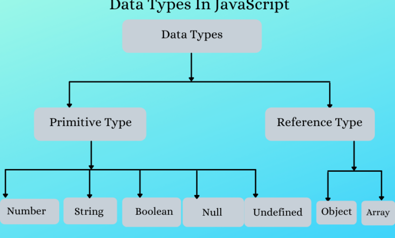

# What Is JavaScript?### 
### JavaScript (JS) is a computer programming language used to make websites and applications dynamic and interactive.

It’s unique because it can run directly in your browser, not just on a server.

Along with hypertext markup language (HTML) and cascading style sheets (CSS), JavaScript is one of the most commonly used programming languages of the internet.

In fact, 98.4% of all websites use JavaScript as of March 2023.

JavaScript, CSS, and HTML work together to make up the user-facing elements of most websites and online applications.

Think of these coding languages as the components of a house:

HTML is the foundation of the house. It provides the basic layout, structure, and content of a website.
CSS is the interior design. It provides design, fonts, colors, effects, and other visual elements. 
JavaScript is the electrical and plumbing systems. JS brings dynamism and interactivity to the website. For example, pop-ups, animations, video and social media embeds, drop-down menus, and many other website components are created using JavaScript.
##History of JavaScript

## History of JavaScript
##### Brendan Eich developed JavaScript in 1995 while working for Netscape.

Netscape sought to develop a scripting language that could help make early versions of the World Wide Web more dynamic.

JavaScript quickly gained popularity as developers realized its ability to add dynamism and interactivity to webpages. 

In 1996, Netscape submitted JavaScript to the European Computer Manufacturers Association (ECMA International), an organization that aims to standardize the use of information technology systems.

This led to the creation of the ECMAScript standard, the formal specifications for JavaScript. 

Its growing popularity has facilitated the development of libraries and frameworks, dedicated JS engines such as V8 (which powers Chrome), and server-side environments.

Despite similarities in name, JavaScript is entirely different from Java.
# what is es6 js?
What is ES6?ES6 stands for ECMAScript 6 .ECMAScript was created to standardize JavaScript, and ES6 is the 6th version of ECMAScript, it was published in 2015, and is also known as ECMAScript 2015.

###  JavaScript Variables and Constants
 ## 1 VAR
 ## 2 LET
 ##  3 CONST

  ## JavaScript provides different data types to hold different types of values. There are two types of data types in JavaScript.
  # 1 Primitive data type.
  # 2 Non-primitive (reference) data type. (object)

  
